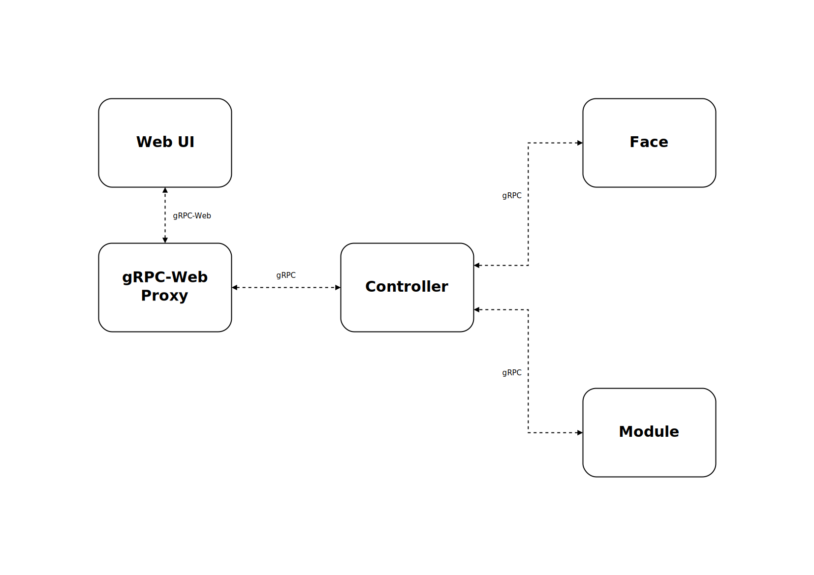

# Architecture

**Kilroy** is divided into multiple parts,
each with their own responsibilities.
You can replace any of these parts with your own implementation,
as long as it conforms to the API.

{ loading=lazy } Architecture diagram

## Parts

You can read more about each part in the following sections.

### Face

The face is the part
that is responsible for communicating with a social media platform.

Think of it as a wrapper around the social media platform's API,
that conforms to the **kilroy** API.

There are default implementation for
[Discord](https://github.com/kilroybot/kilroy-face-discord)
and [Twitter](https://github.com/kilroybot/kilroy-face-twitter).
You should write your own face
if you want to use **kilroy** with a platform that is not supported by default.

### Module

A module is a part responsible
for handling all operations related to the model, like generating output
and updating weights.

Again, think of it as a wrapper around the model of your choice that conforms
to the **kilroy** API.

There is a default implementation for any models that are supported by
[HuggingFace](https://github.com/kilroybot/kilroy-module-huggingface).
You should write your own module
if you want to use **kilroy** with your own model.

### Controller

The controller is the part that controls the training process using the face
and the module.
It also serves as a gateway to the system from outside (e.g. from the Web UI).

The default implementation can be found
[here](https://github.com/kilroybot/cilroy)
and should be sufficient for most use cases.
But of course, you can write your own controller.

### gRPC-Web Proxy

This parts enables the Web UI to communicate with the controller.
You can find the implementation
[here](https://github.com/kilroybot/grpc-web-proxy).
It should work as it is.

### Dashboard

The dashboard is a web app that can be used to control the training process.
Think about it as the easiest to use interface for the whole system.
The default implementation can be found
[here](https://github.com/kilroybot/kilroyweb).

## Communication

The communication between the parts is done using gRPC.
The gRPC definitions can be found
[here](https://kilroybot.github.io/proto).
You can use them to generate stubs that conform to the API
for your own implementations in any language.
