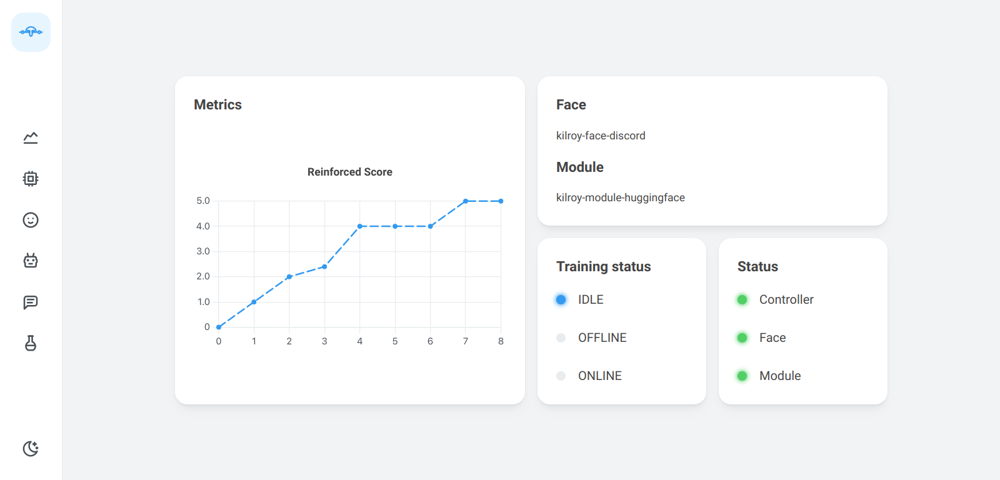
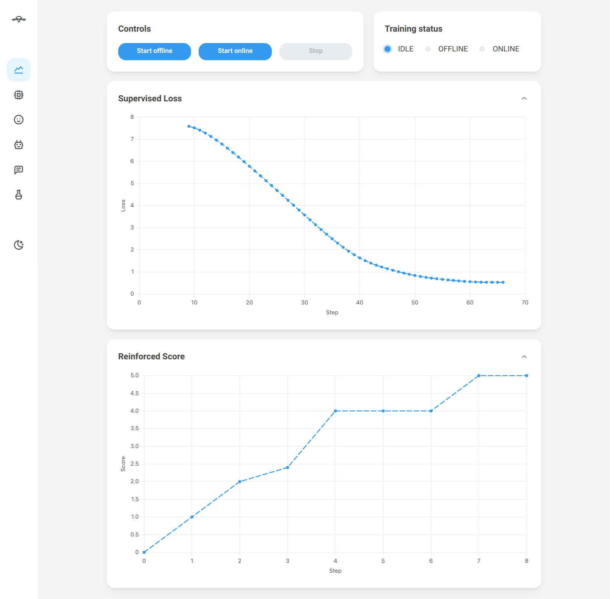
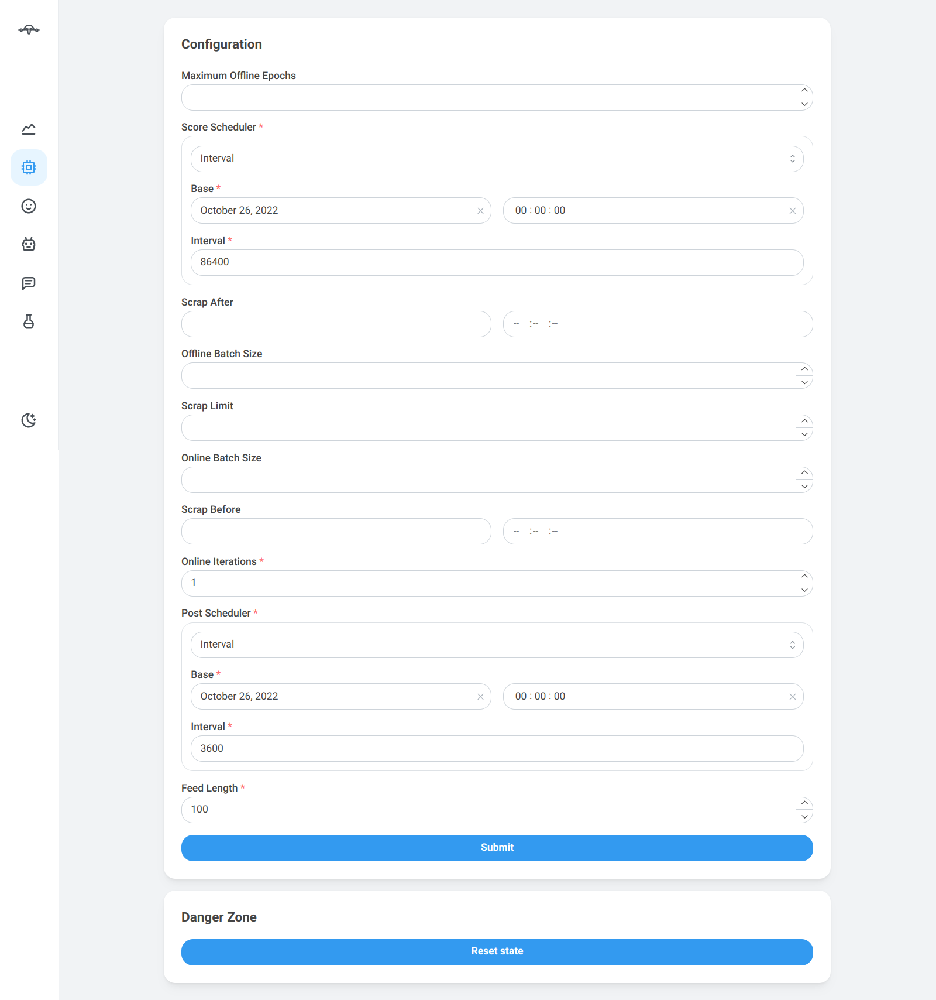
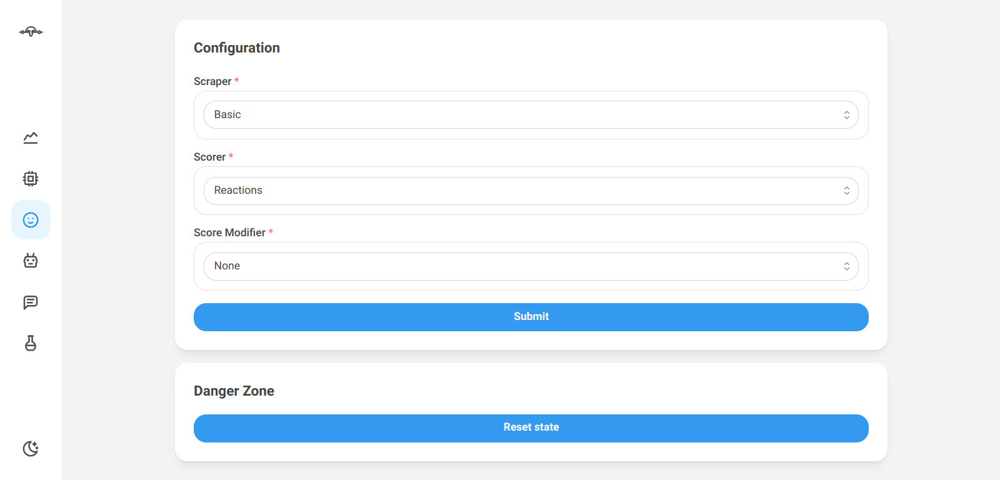
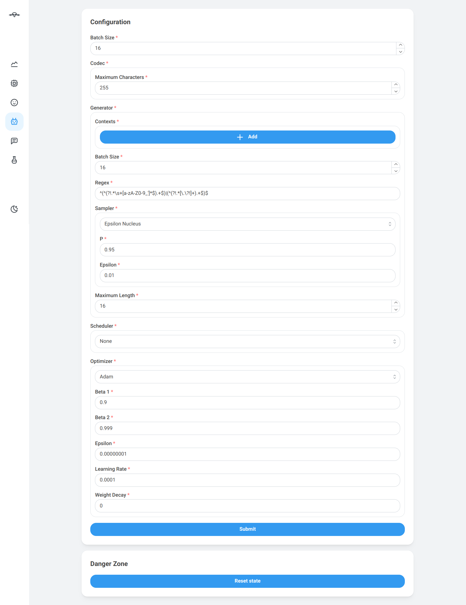
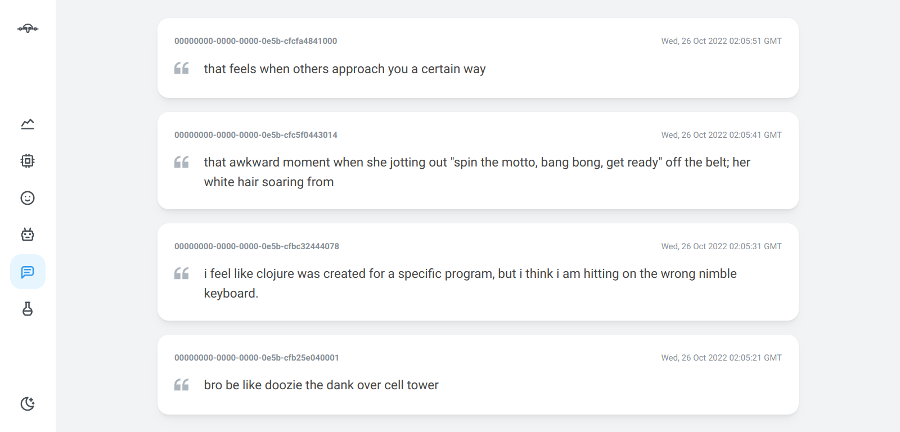
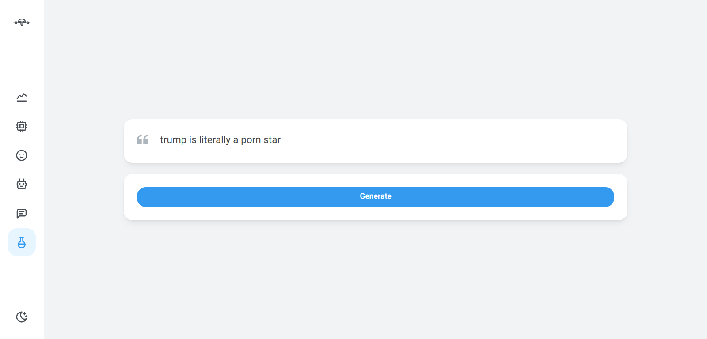

# Dashboard

The main way to interact with the system is through the dashboard.
The dashboard is a web application
that allows you to control the training process.

It is accessible at
[`http://localhost:14000`](http://localhost:14000) by default.

## Pages

The dashboard has several pages described below.

### Home

The home page shows the current status and metadata
of all the components of the system.
It also shows the current status of the training process
and a simplified view of the metrics.

{ loading=lazy }

### Training

The training page allows you to see and control the training process.
Read more in the [training](usage/training.md) page.

{ loading=lazy }

### Controller

The controller page shows the configuration of the controller
and allows you to modify it.
Read more in the [configuration](usage/configuration.md) page.

{ loading=lazy }

### Face

The face page shows the configuration of the face
and allows you to modify it.
Read more in the [configuration](usage/configuration.md) page.

{ loading=lazy }

### Module

The module page shows the configuration of the module
and allows you to modify it.
Read more in the [configuration](usage/configuration.md) page.

{ loading=lazy }

### Feed

The feed page displays the latest posts,
so that you can keep track of what, when and where has been posted.

{ loading=lazy }

### Playground

The playground page allows you to generate posts without actually posting them.
This way you can see what the model is capable of generating at any given time.

{ loading=lazy }
